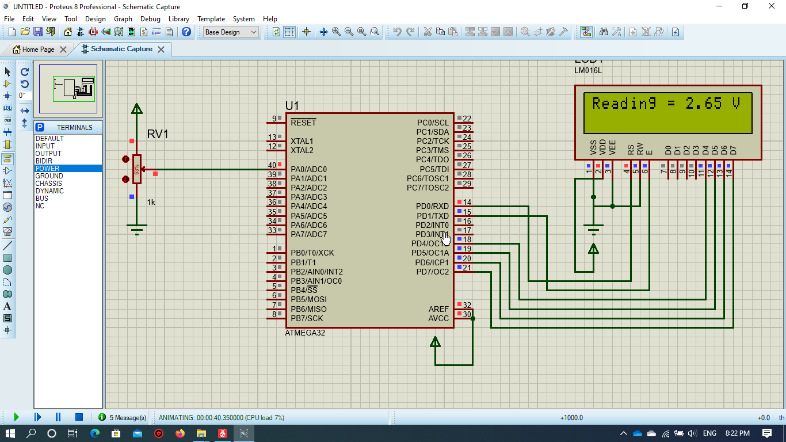
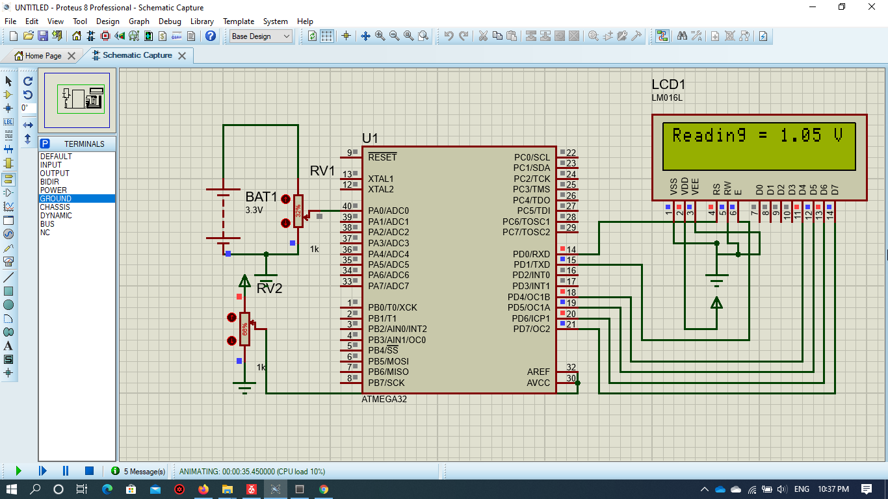
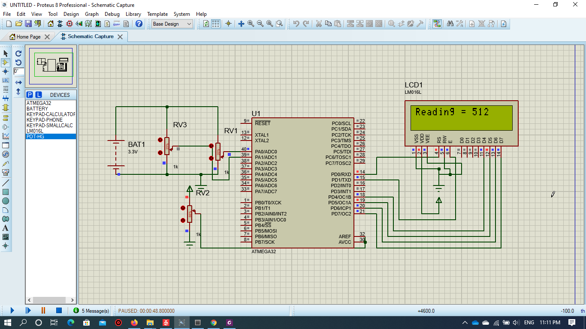
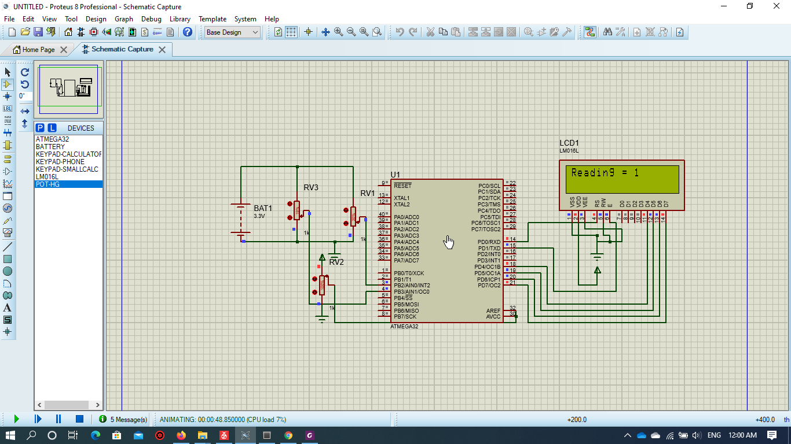
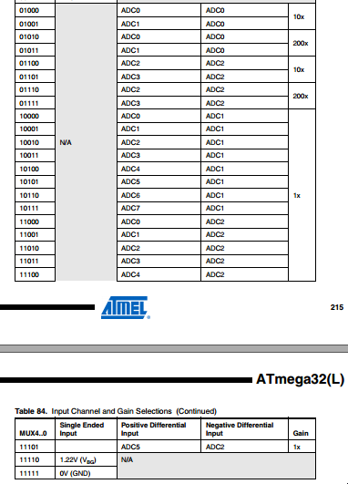

# ADC


* The Driver is written in Arduino functions Format to allow users understand avr Driver for Atmega 32


## Examples

### Interfacing with 5V Sensor example

* This example shows how to interface Atmega32 with a 5v Sensor(ex: potentiometer) and display the sensor reading on LCD    



```

#define F_CPU 1000000UL
#include "lcd.h"
#include "Gpio.h"
#include "ADC.h"
#include "stdio.h"
#include <util/delay.h>
int main(void)
{			
	    
            ADC_Init();
			LCD_SetUpReg(D0,D1,REGD_UPPER);
			LCD_Begin(16,2);
			float x;
			while (1)
			{
				LCD_SetPosition(0,0);
			    LCD_String("Reading = ");
				x=analogReadVolts(A0,5);
				LCD_Print(&x,FLOAT);
			    LCD_String(" V");
				
			}

}


```

### Interfacing with 3.3V Sensor example

* This example shows how to interface Atmega32 with a 3.3v Sensor(ex: potentiometer) and change the reference to 3.3v with 10 bit resolution and display the sensor reading on LCD    

 

```

#define F_CPU 1000000UL
#include "lcd.h"
#include "Gpio.h"
#include "ADC.h"
#include "stdio.h"
#include <util/delay.h>

int main(void)
{			
	    
            ADC_Init();
			analogReference(EXTERNAL);
			LCD_SetUpReg(D0,D1,REGD_UPPER);
			LCD_Begin(16,2);
			float x;
			while (1)
			{
				LCD_SetPosition(0,0);
			    LCD_String("Reading = ");
				x=analogReadVolts(A0,3.3);
				LCD_Print(&x,FLOAT);
			    LCD_String(" V");
				
			}

}
```

### Reading ADC value with interrupt service routine(ISR) example

* This example shows how to interface Atmega32 with a 3.3v Sensor(ex: potentiometer) and change the reference to 3.3v with 10 bit resolution and read with ISR and display the sensor reading on LCD    

 

```

#define F_CPU 1000000UL
#include "lcd.h"
#include "Gpio.h"
#include "ADC.h"
#include "stdio.h"
#include <util/delay.h>
volatile float x;
void Reading(){
	x=analogReadVolts(A0,3.3);
	ADC_startConversion(A0);
	
}
int main(void)
{			
	    
            ADC_Init();
			analogReference(EXTERNAL);
			ADC_attachInterrupt(Reading);
			LCD_SetUpReg(D0,D1,REGD_UPPER);
			LCD_Begin(16,2);
			ADC_startConversion(A0);
			while (1)
			{
				LCD_SetPosition(0,0);
			    LCD_String("Reading = ");
				LCD_Print(&x,FLOAT);
			    LCD_String(" V");
				
			}

}


```

### differential Reading ADC value example

* This example shows how to interface Atmega32 with 2 3.3v Sensors (ex: potentiometer) and change the reference to 3.3v with 10 bit resolution and read the difference in reading with gain 10 and display the sensor reading on LCD    

 

```


#define F_CPU 1000000UL
#include "lcd.h"
#include "Gpio.h"
#include "ADC.h"
#include "stdio.h"
#include <util/delay.h>
int main(void)
{			
	    
            ADC_Init();
			analogReference(EXTERNAL);
			LCD_SetUpReg(D0,D1,REGD_UPPER);
			LCD_Begin(16,2);
			int x;
			while (1)
			{
				LCD_SetPosition(0,0);
			    LCD_String("Reading = ");
                x=differentialRead(9); //input no. between 8 and 31 to select which channels to get their difference and choose the gain 
				LCD_Print(&x,INT);
				_delay_ms(100);
			    LCD_Clear();
				
			}

}

```

### Analog Comparator example

* This example shows how to interface Atmega32 with 2 3.3v Sensors (ex: potentiometer) and compare the between the 2 readings and show which reading is higher on LCD    

 

```

#define F_CPU 1000000UL
#include "lcd.h"
#include "Gpio.h"
#include "ADC.h"
#include "stdio.h"
#include <util/delay.h>
int main(void)
{			
	    
            AnalogComparator(AINN1); // input AINN1 or A0-A7
			LCD_SetUpReg(D0,D1,REGD_UPPER);
			LCD_Begin(16,2);
			int x;
			while (1)
			{
				LCD_SetPosition(0,0);
			    LCD_String("Reading = ");
				x=analog_compare();
				LCD_Print(&x,INT);
								
			}

}

```

* Inorder to get the adc value using ISR use

```
ADC_ReturnValue()
```

 

* In differential Mode, you have to input a number between 8 to 31 to choose which channels to compare between and get the difference value between them ( out= (((v1-v2)*gain)/vref)*1024 ) and choose the gain of the  reading

* To change the ADC clock prescaler use 

```
setADC_Prescaler( Prescaler value )
```
 