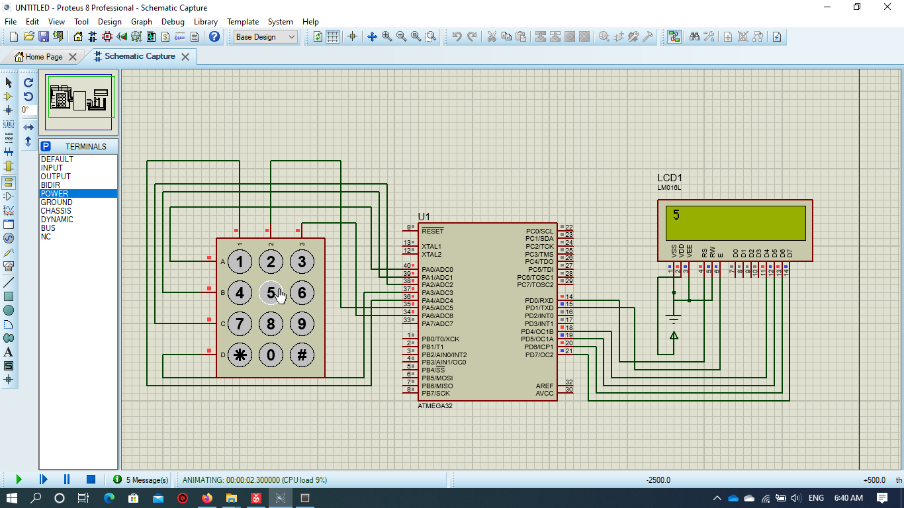
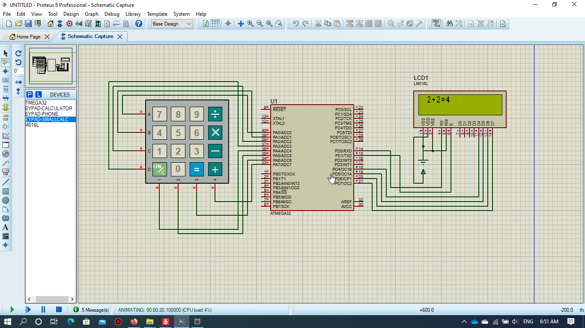
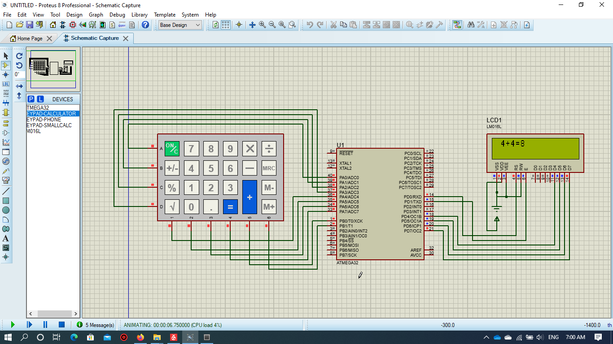

# KEYPAD


* The Driver is written in Arduino functions Format to allow users understand avr Driver for Atmega 32


## Examples

### Interfacing with 4X3 KEYPAD example

* This example shows how to interface Atmega32 with 4X3 Keypad and display output on LCD    



```

#define F_CPU 1000000UL
#include "lcd.h"
#include "Gpio.h"
#include "keypad.h"
#include <util/delay.h>
int main(void)
{
	unsigned char rows[4]={A0,A1,A2,A3};
	unsigned char cols[3]={A4,A5,A6};	
	unsigned char Keys[4][3]={
	{'1','2','3'},
	{'4','5','6'},
	{'7','8','9'},
	{'*','0','#'}};
			
	    Keypad_SetUp(rows,cols,4,3,Keys);

			LCD_SetUpReg(D0,D1,REGD_UPPER);
			LCD_Begin(16,2);
			unsigned char x; 
			
			while (1)
			{
				x = Keypad_getKey();
				LCD_SetPosition(0,0);
				LCD_Char(x);
				
				
			}

}
 ```

### Interfacing with 4X4 KEYPAD example

* This example shows how to interface Atmega32 with 4X4 Keypad and display sum of 2 numbers as output on LCD    
 
 

```
#define F_CPU 1000000UL
#include "lcd.h"
#include "Gpio.h"
#include "keypad.h"
#include <util/delay.h>
int main(void)
{
	unsigned char rows[4]={A0,A1,A2,A3};
	unsigned char cols[4]={A4,A5,A6,A7};	
	unsigned char Keys[4][4]={
	{'7','8','9','/'},
	{'4','5','6','X'},
	{'1','2','3','-'},
	{'C','0','=','+'}};
			
	    Keypad_SetUp(rows,cols,4,4,Keys);

			LCD_SetUpReg(D0,D1,REGD_UPPER);
			LCD_Begin(16,2);
			unsigned char x,pre=NOKEY; 
			char i=0;
			while (1)
			{
				x = Keypad_waitUntilKey();
				if(pre!=x)
				{i++;
				pre=x;}
				LCD_SetPosition(0,i);
				LCD_Char(x);
								
			}

}

```

### Interfacing with 4X6 KEYPAD example

* This example shows how to interface Atmega32 with 4X6 Keypad and display sum of 2 numbers as output on LCD    
 
 

```
#define F_CPU 1000000UL
#include "lcd.h"
#include "Gpio.h"
#include "keypad.h"
#include <util/delay.h>
int main(void)
{
	unsigned char rows[4]={A0,A1,A2,A3};
	unsigned char cols[6]={A4,A5,A6,A7,B0,B1};	
	unsigned char Keys[4][6]={
	{'C','7','8','9','X','/'},
	{'+','4','5','6','-','M'},
	{'%','1','2','3','+','_'},
	{'R','0','.','=','+','#'}};
			
	    Keypad_SetUp(rows,cols,4,6,Keys);

			LCD_SetUpReg(D0,D1,REGD_UPPER);
			LCD_Begin(16,2);
			unsigned char x,pre=NOKEY; 
			char i=0;
			while (1)
			{
				x = Keypad_waitUntilKey();
				if(pre!=x)
				{i++;
				pre=x;}
				LCD_SetPosition(0,i);
				LCD_Char(x);
				
				
			}

}

```

