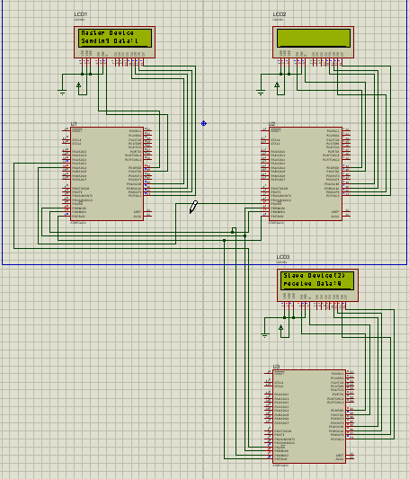
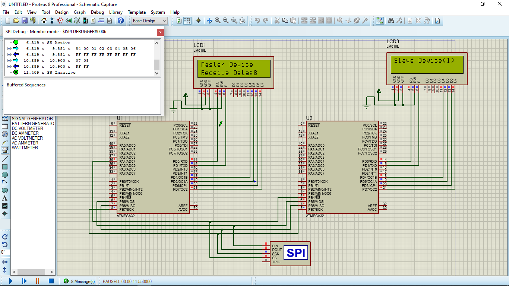

# SPI


* The Driver is written in Arduino functions Format to allow users understand avr Driver for Atmega 32


## Examples

### Sending data between 1 master and 2 slaves example

* This example shows how to interface 3 Atmega32 , one as a master and the others as slave devices and display the output on LCD    



### Master
```

#define F_CPU 1000000UL
#include "SPI.h"
#include "Gpio.h"
#include "lcd.h"
#include <stdio.h>
#include <util/delay.h>

#define CS1 A4
#define CS2 A3

int main(void)
{
	char count,buffer[5];
	pinMode(CS1,OUTPUT);
	pinMode(CS2,OUTPUT);
	digitalWrite(CS1,HIGH);
	digitalWrite(CS2,HIGH);
	
	SPI_MasterInit();
	LCD_SetUpReg(D0,D1,REGD_UPPER);
	LCD_Begin(16,2);
	      
    while (1) 
    {
	digitalWrite(CS1,LOW);
	LCD_Clear();
	LCD_String_xy("Master Device",0, 0);
	LCD_String_xy("Sending Data:  ",1, 0);
	
	for(count=0;count<=20;count++)
	{
		SPI_Write(count);
		sprintf(buffer, "%d   ", count);
		LCD_String_xy(buffer,1, 13);
		_delay_ms(500);
	}
	
	digitalWrite(CS1,HIGH);
	
	digitalWrite(CS2,LOW);
	LCD_Clear();
	LCD_String_xy("Master Device",0, 0);
	LCD_String_xy("Sending Data:  ",1, 0);
	
	for(count=0;count<=20;count++)
	{
		SPI_Write(count);
		sprintf(buffer, "%d   ", count);
		LCD_String_xy(buffer,1, 13);
		_delay_ms(500);
	}
	
	digitalWrite(CS2,HIGH);
	
	_delay_ms(100);
	}
    
}


```


### SLAVE(1) 

```

#define F_CPU 1000000UL
#include "SPI.h"
#include "Gpio.h"
#include "lcd.h"
#include <stdio.h>
#include <util/delay.h>


int main(void)
{
	char count,i,buffer[5];
	SPI_SlaveInit();
	LCD_SetUpReg(D0,D1,REGD_UPPER);
	LCD_Begin(16,2);
	      
    while (1) 
    {
	LCD_Clear();
	
	for(i=0;i<=20;i++)
	{
		count=SPI_Read();
		LCD_String_xy("Slave Device(1)",0, 0);
		LCD_String_xy("receive Data:  ",1, 0);
		sprintf(buffer, "%d   ", count);
		LCD_String_xy(buffer,1, 13);
	}
	_delay_ms(500);


	}
    
}


```

### SLAVE(2) 

```

#define F_CPU 1000000UL
#include "SPI.h"
#include "Gpio.h"
#include "lcd.h"
#include <stdio.h>
#include <util/delay.h>


int main(void)
{
	char count,i,buffer[5];
	SPI_SlaveInit();
	LCD_SetUpReg(D0,D1,REGD_UPPER);
	LCD_Begin(16,2);
	      
    while (1) 
    {
	LCD_Clear();
	
	for(i=0;i<=20;i++)
	{
		count=SPI_Read();
		LCD_String_xy("Slave Device(2)",0, 0);
		LCD_String_xy("receive Data:  ",1, 0);
		sprintf(buffer, "%d   ", count);
		LCD_String_xy(buffer,1, 13);
	}
	_delay_ms(500);


	}
    
}


```


### Slave transmitter master receiver example

* This example send data from slave to master and display the output on LCD    



### Master
```

#define F_CPU 1000000UL
#include "SPI.h"
#include "Gpio.h"
#include "lcd.h"
#include <stdio.h>
#include <util/delay.h>

#define CS1 A4


int main(void)
{
	char i,count=0,buffer[5];
	char* name;
	pinMode(CS1,OUTPUT);
	digitalWrite(CS1,HIGH);


	SPI_MasterInit();
	LCD_SetUpReg(D0,D1,REGD_UPPER);
	LCD_Begin(16,2);
	
	while (1)
	{
		
		LCD_Clear();
		LCD_String_xy("Master Device",0, 0);
		LCD_String_xy("Receive Data:  ",1, 0);	
		digitalWrite(CS1,LOW);
		for(i=0;i<10;i++)
		{
			count=SPI_Read();
			sprintf(buffer,"%d",count);
			if(count<=9)
			LCD_String_xy(buffer,1,13);	
			_delay_ms(500);		
		}
		
		digitalWrite(CS1,HIGH);
		_delay_ms(1000);
	}
	
}


```


### SLAVE 

```

#define F_CPU 1000000UL
#include "SPI.h"
#include "Gpio.h"
#include "lcd.h"
#include <stdio.h>
#include <util/delay.h>

volatile unsigned char data=0;
volatile unsigned char flag=0;

void send(){

SPI_loadData(data);
flag=1;
	
}

int main(void)
{
	char i,buffer[5];
	SPI_SlaveInit();
	SPI_attachInterrupt(send);
	LCD_SetUpReg(D0,D1,REGD_UPPER);
	LCD_Begin(16,2);
	
	while (1)
	{
		LCD_String_xy("Slave Device(1)",0, 0);
		for(i=0;i<10;i++)
		{
			while(flag==0);
		    
			LCD_String_xy("Sending Data:  ",1, 0);
			sprintf(buffer,"%d",data);
			LCD_String_xy(buffer,1,13);
			data++;
			flag=0;
		}
		data=0;
		_delay_ms(500);
		LCD_Clear();
			
		

	}
	
}

```


* In Atmega 32, We have 1 SPI Port with pins which are B5(MOSI),B6(MISO),B7(SCK),B4(SS). 


* you have to define chip select pins when initializing the master to select which slave to listen. You can define any pin in the microcontroller as chip select pin. In slaves, the slave select pin is already defined as B4.

* you have to clear the chip select pin for the slave that want to listen to the master.

* the clock of the spi is already defined in the library as 1/24 of the clock frequency. In order to change it, you have to edit this part in the library according to the datasheet. 

* you can use the SPI debugger on proteus to see what you actualy received on the master and the slave with this simple explanation:
```
1. all numbers appearing are in hexadecimal format
2. the SPI debugger simulates the way data is transmitted and received in the SPI protocol
3. you can also send data to the bus by the SPI debugger
```
 
