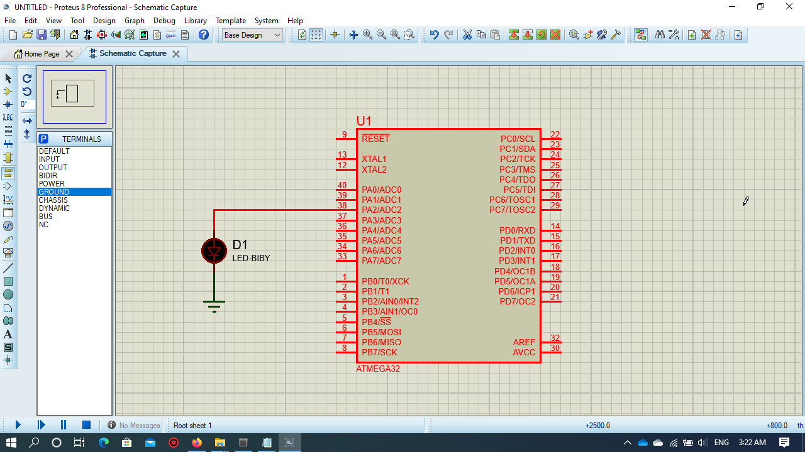
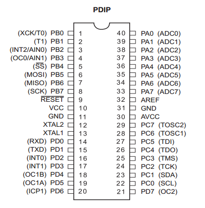

# GPIO


* The Driver is written in Arduino functions Format to allow users understand avr Driver for Atmega 32


## Examples

### Blink example

* This Blink example clarifies the  functions used in the library
in Order to toggle an Led every 1 Sec. 
 


```

#define F_CPU 1000000UL
#include "Gpio.h"
#include <util/delay.h>
int main(void)
{  pinMode(A2,OUTPUT);
	
  while (1) 
    {
	digitalWrite(A2,HIGH);
	_delay_ms(1000);
	digitalWrite(A2,LOW);
	_delay_ms(1000);
		
    }
}

 ```

### Reading a pushbutton and display output on LED without debouncing example

* This example clarifies the  functions used in the library
in Order to Read the value on a digital Pin connected to a push button
and display the output on LED. 
 
 

```

#define F_CPU 1000000UL
#include "Gpio.h"
#include <util/delay.h>

int main(void)
{  pinMode(A2,OUTPUT);
   pinMode(A3,INPUT_PULLUP);

    while (1) 
    {
	if( digitalRead(A3) == false )
	{
	_delay_ms(30);
	if( digitalRead(A3) == false )
	digitalWrite(A2,HIGH);
	else
	digitalWrite(A2,LOW);
    }
    else
    digitalWrite(A2,LOW);

    }

}

```


### Reading a pushbutton and display output on LED Using External Interrupts

* This example clarifies the  functions used in the library
in Order to Read the value on an Interrupt Pin connected to a push button
and display the output on LED using External Interrupts(Interrupt on Falling Edge). 


```

#define F_CPU 1000000UL
#include "Gpio.h"
#include <util/delay.h>
volatile char x=0;
void TogglePin()
{
	if(x==0)
	{
	digitalWrite(A2,HIGH);
	x=1;
	}
	else
	{
	digitalWrite(A2,LOW);
	x=0;
	}
	
}

int main(void)
{  pinMode(A2,OUTPUT);
   pinMode(D2,INPUT_PULLUP);
   attachInterrupt(D2,INT_FALLING,TogglePin);
    while (1) 
    {
	
    }

}


```

* In Atmega 32, We have 3 external Interrupt pins which are D2(INT0),D3(INT1), and B2 (INT2). 





* INT0 and INT1 interrupts has 4 causes for interrupt : LOW(INT_LOW),CHANGE(INT_CHANGE),FALLING(INT_FALLING), and RISING (INT_RISING)

* INT2 interrupts has 2 causes :  FALLING(INT_FALLING), and RISING (INT_RISING)

* To disable  all interrupts in the microcontroller you can use
```
noInterrupts();
```

* To reenable all interrupts in the microcontroller you can use
```
Interrupts();
``` 

