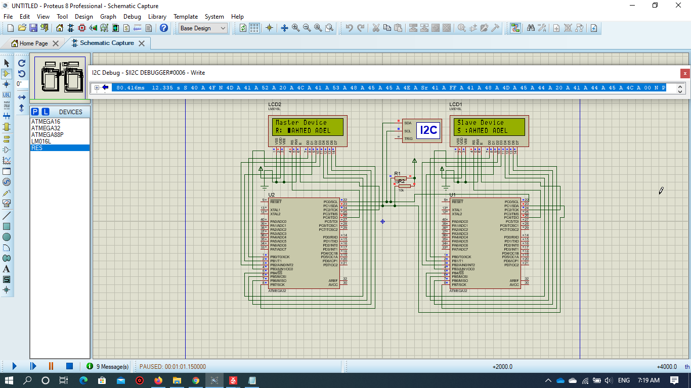

# I2C


* The Driver is written in Arduino functions Format to allow users understand avr Driver for Atmega 32


## Examples

### Sending and Receiving strings between 2 microcontrollers example

* This example shows how to interface 2 Atmega32 to send and receive strings("OMAR LASHEEN","AHMED ADEL") by I2C and display the output on LCD    



### Master
```

#define F_CPU 1000000UL						/* Define CPU clock Frequency e.g. here its 8MHz */
#include <avr/io.h>							/* Include AVR std. library file */
#include <util/delay.h>						/* Include inbuilt defined Delay header file */
#include <stdio.h>							/* Include standard I/O header file */
#include <string.h>							/* Include string header file */
#include "I2C.h"				/* Include I2C header file */
#include "lcd.h"				/* Include LCD header file */

#define Slave_Write_Address		0x40
#define Slave_Read_Address		0x41
#define	count					12

int main()
{
	char buffer[10];
	char name[20];
	strcpy(name,"OMAR LASHEEN");
	LCD_SetUpReg(C4,C2,REGB);
	LCD_Begin(16,2);								/* Initialize LCD */
	I2C_Master_Init(100000);								/* Initialize I2C */
	
	
	while (1)
	{
		LCD_Clear();
		LCD_String_xy("Master Device",0,0);
		LCD_String_xy("S : ",1,0);
		I2C_Start_Wait(Slave_Write_Address);/* Start I2C communication with SLA+W */
		_delay_ms(5);
		for (int i = 0; i < count ; i++)
		{
			LCD_Char(name[i]);
			I2C_Write(name[i]);					/* Send Incrementing count */
			_delay_ms(500);
		}
		LCD_Clear();
		LCD_String_xy("Master Device",0,0);
		LCD_String_xy("R: ",1,0);
		I2C_Repeated_Start(Slave_Read_Address);	/* Repeated Start I2C communication with SLA+R */
		_delay_ms(5);
		for (int i = 0; i < count; i++)
		{
			if(i < count - 1)
				sprintf(buffer, "%c", I2C_Read_Ack());/* Read and send Acknowledge of data */
			else
				sprintf(buffer, "%c", I2C_Read_Nack());/* Read and Not Acknowledge to data */
			LCD_Char(buffer[0]);
			_delay_ms(500);
		}
		I2C_Stop();							/* Stop I2C */
	}
}

```


### SLAVE

```


#define F_CPU 1000000UL							/* Define CPU clock Frequency e.g. here its 8MHz */
#include <avr/io.h>								/* Include AVR std. library file */
#include <util/delay.h>							/* Include inbuilt defined Delay header file */
#include <stdio.h>								/* Include standard I/O header file */
#include <string.h>								/* Include string header file */
#include "lcd.h"					/* Include LCD header file */
#include "I2C.h"					/* Include I2C slave header file */

#define Slave_Address			0x40

int main(void)
{
	char name[20];
	strcpy(name,"AHMED ADEL");
	int8_t count = 0;
	
	LCD_SetUpReg(C4,C2,REGB);
	LCD_Begin(16,2);								/* Initialize LCD */
	I2C_Slave_Init(Slave_Address);
	
	LCD_String_xy("Slave Device",0,0);
	
	while (1)
	{
		switch(I2C_Slave_Listen())				/* Check for any SLA+W or SLA+R */
		{
			case 0:
			{
				LCD_Clear();
				LCD_String_xy("Slave Device",0,0);
				LCD_String_xy("R: ",1,0);
				do
				{
					count = I2C_Slave_Receive();/* Receive data byte*/
					LCD_Char(count);
					
				} while (count != -1);			/* Receive until STOP/REPEATED START received */
				count = 0;
				break;
			}
			case 1:
			{
				LCD_Clear();
				LCD_String_xy("Slave Device",0,0);
				int8_t Ack_status;
				LCD_String_xy("S :",1,0);
				do
				{
					Ack_status = I2C_Slave_Transmit(name[count]);	/* Send data byte */
					LCD_Char(name[count]);
					count++;
				} while (Ack_status == 0);		/* Send until Acknowledgment is received */
				break;
			}
			default:
				break;
		}
	}
}


```


* In Atmega 32, We have 1 I2C Port with pins which are C0(SCL),C1(SDA). 


* you have to write the proper value of the I2c clock frequency when initializing the master

* you can check the status(check the values defined in i2c.h) of the i2c port to know what the port has received 

* you can use the I2C debugger on proteus to see what you actualy received on the master and the slave with this simple explanation:
```
1. all numbers appearing are in hexadecimal format
2. the i2c debugger simulates the way data is transmitted and received in the i2c protocol(check the image of the example)
3. S means (Start condition),Sr means (Repeated Start condition),A means (Acknowledge),N means (Not Acknowledge),P means (Stop Condition)
4. you can also send data to the bus by the I2C debugger
```
 