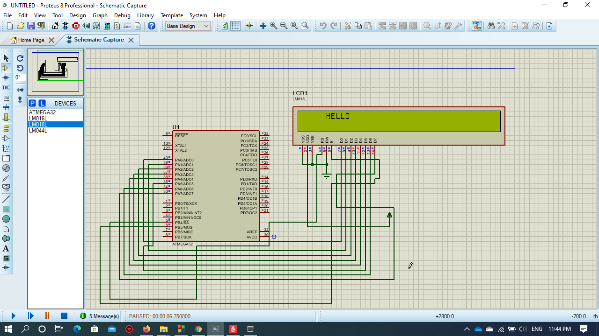

# LCD


* The Driver is written in Arduino functions Format to allow users understand avr Driver for Atmega 32


# Examples

## Shifting a string on 20X4 LCD example

* This  example clarifies the  functions used in the library
in Order to move a string "welcome" from left to right on an LCD 
 


```


#define F_CPU 1000000UL
#include "lcd.h"
#include "Gpio.h"
#include <util/delay.h>
int main(void)
{

LCD_SetUpReg(B4,B5,REGA_UPPER);
LCD_Begin(20,4);
for(int i=0;i<13;i++)
{
LCD_String_xy("Welcome",0,i);
_delay_ms(200);
LCD_Clear();
}

    while (1) 
    {
		
    }
}


 ```


## Shifting a string on 40X2 LCD example example

* This  example clarifies the  functions used in the library
in Order to move a string "HELLO" from right to left on an LCD 




 
```
 
#define F_CPU 1000000UL
#include "lcd.h"
#include "Gpio.h"
#include <util/delay.h>
int main(void)
{

LCD_SetUpReg(B4,B5,REGA);
LCD_Begin(40,2);
for(int i=35;i>0;i--)
{
LCD_String_xy("HELLO",0,i);
shift_left();
_delay_ms(200);
LCD_Clear();
}

    while (1) 
    {
		
    }
}
  
```

## Creating custom characters on 40X2 LCD example example

* This  example clarifies the  functions used in the library
in Order to write my name in arabic from right to left on an LCD 


```

#define F_CPU 1000000UL
#include "lcd.h"
#include "Gpio.h"
#include <util/delay.h>
int main(void)
{

unsigned char Character1[8] = 
{ 0b10011111, 
  0b11110000,
  0b11110000,
  0b11110000,
  0b11110000,
  0b11111000,
  0b01111110,
  0b11111111 };  /* Custom char set for alphanumeric LCD Module */

unsigned char Character3[8] =
{   0b00000111,
	0b00000111,
	0b00000111,
	0b00001110,
	0b00011100,
	0b00111000,
	0b01110000,
	0b11100000 };  /* Custom char set for alphanumeric LCD Module */

unsigned char Character2[8] = { 0x00, 0x0A, 0x1F, 0x1F, 0x0E, 0x04, 0x00, 0x00 };


	LCD_SetUpReg(B4,B5,REGA);
	LCD_Begin(16,2);
	
	LCD_Custom_Char(0, Character1);  /* Build Character1 at position 39 */
	LCD_Custom_Char(1, Character2);  /* Build Character1 at position 35 */
	LCD_Custom_Char(2, Character3);  /* Build Character3 at position 37 */
    increment_Left();
	LCD_SetPosition(0,15);
    LCD_Char(0);
	LCD_Char('O');
	LCD_Char(2);
	LCD_Char(' ');
	LCD_Char(1);

	while (1)
	{
		
	}
}

```

## Display "Omar Lasheen" example

* This  example clarifies the  functions used in the library
in Order to Display my name "OMAR LASHEEN" on an LCD connected with separated pins in 4-bit mode 


```

#define F_CPU 1000000UL
#include "lcd.h"
#include "Gpio.h"
#include <util/delay.h>
int main(void)
{
    char pins[4]={A0,B0,C0,D0};
	LCD_SetUpManual(4,B4,B5,pins);
	LCD_Begin(40,2);
	
	LCD_SetPosition(0,18);
    LCD_String("OMAR LASHEEN");
	
	while (1)
	{}
}


```

## Display FLOAT number example


```

#define F_CPU 1000000UL
#include "lcd.h"
#include "Gpio.h"
#include <util/delay.h>
int main(void)
{
    char pins[4]={A0,B0,C0,D0};
	LCD_SetUpManual(4,B4,B5,pins);
	LCD_Begin(40,2);
	float x=20.222;
	LCD_SetPosition(0,18);
    LCD_Print(&x,FLOAT);
	
	while (1)
	{}
}


```

* this library is designed to access lcd pixels of	16X2, 20x4 , 40x2 LCDS


* you can use the library to interface with lcd in 4-bit mode(D4-D7) and 8-bit mode

* pin R/W is connected to ground and vee is connected to potentiometer to control brightness,
and it is connected to ground to achieve maximum brightness

* the lcd is able to display all types of data (INT,FLOAT,CHAR,STRING)
 
* address of first line starts at 0x80 , address of 2nd line starts at 0xC0, address of 3rd line starts at 0x94, and the address of 4th line starts at 0xD4 

* in order to display the cursor(default of the diplay in lcd in OFF) use 
```
CURSOR_ON();
```
* in order to turn off the display of the cursor use 
```
CURSOR_OFF();
```
* in order to display the LCD(default of the diplay in lcd in ON) use 
```
DISPLAY_ON();
```
* in order to turn off the display of the cursor use 
```
DISPLAY_OFF();
```

