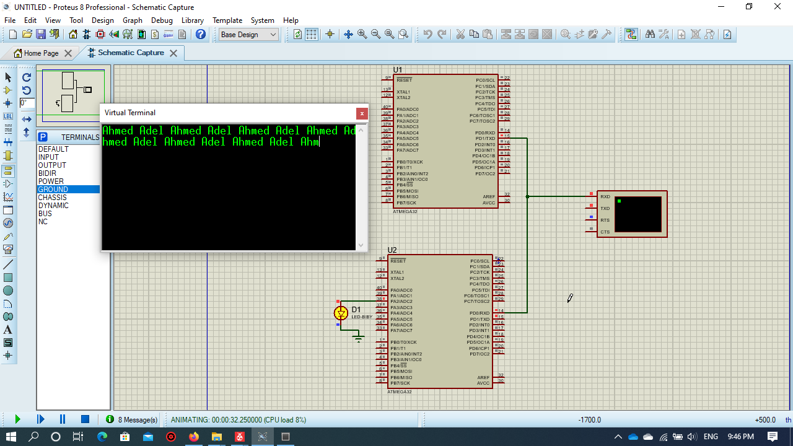

# Serial Communication(UART)


* The Driver is written in Arduino functions Format to allow users understand avr Driver for Atmega 32


# Examples

## Transmitting and Recieving  between 2 microcontrollers example

* This  example clarifies the  functions used in the library
in Order to send and recieve a string between 2 microcontrollers and enlight an led if the string is recieved correctly
 



### Transmitter


```

#define F_CPU 1000000UL
#include "Gpio.h"
#include "Serial.h"
#include <util/delay.h>
char x[20];
int main(void)
{
	
	Serial_begin(4800);
	
		
	while (1)
	{
		Serial_print("Ahmed Adel ",STRING);
	}
}

 ```


### Reciever


```

#define F_CPU 1000000UL
#include "Gpio.h"
#include "Serial.h"
#include <string.h>
char x[20];
int main(void)
{
	pinMode(A2,OUTPUT);
	Serial_begin(4800);
	digitalWrite(A2,LOW);
	
	while (1)
	{
		
	if(Serial_available()>0)
	{
		Serial_readString(x,12);
	    
	}
	
	if(!strcmp(x,"Ahmed Adel "))
	digitalWrite(A2,HIGH);
	else
	digitalWrite(A2,LOW);
	
	}

}

```
  


## Transmitting and Recieving  between 2 microcontrollers using interrupt example

* This  example clarifies the  functions used in the library
in Order to send and recieve a string between 2 microcontrollers and enlight an led if the string is recieved correctly
 


### Transmitter


```

#define F_CPU 1000000UL
#include "Gpio.h"
#include "Serial.h"
#include <util/delay.h>
#include <avr/io.h>
void transmit(){
	
	UDR='A';
}
int main(void)
{
	
	Serial_begin(4800);
	Serial_attachInterrupt(TX_INTERRUPT,transmit);
		
	while (1)
	{}
}

 ```


### Reciever


```


#define F_CPU 1000000UL
#include "Gpio.h"
#include "Serial.h"
#include <string.h>
volatile char x;

void recieve(){
	x=Serial_read();
}

int main(void)
{
	pinMode(A2,OUTPUT);
	Serial_begin(4800);
	Serial_attachInterrupt(RX_INTERRUPT,recieve);
	digitalWrite(A2,LOW);
	
	while (1)
	{
		
	if(x=='A')
	digitalWrite(A2,HIGH);
	else
	digitalWrite(A2,LOW);
	
	}

}  
```


* In Atmega 32, We have 1 Serial Port with pins  D0(RX),D1(TX). 


* To recieve  a string until a specific character you can use
```
Serial_readStringUntil(array to store the string,the character to wait until recieved)
```

* To recieve a single character you can use
```
Serial_Read()
``` 
*to free(flush) the Serial buffer use
``` 
Serial_flush() 
```
*the default case in the UART protocol is that there is NO parity bit. to add Parity bit in the protocol use 

``` 
void Add_ParityBit( Type of parity ) // 3 cases: NO_PARITY , EVEN_PARITY , ODD_PARITY
```
* to make the UART protocol in U2X_transmission mode(check the data sheet) use
``` 
void Set_U2X_transmission() 
```

 

