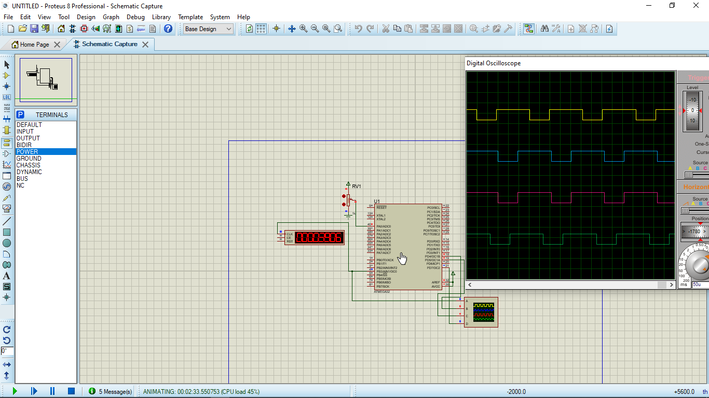
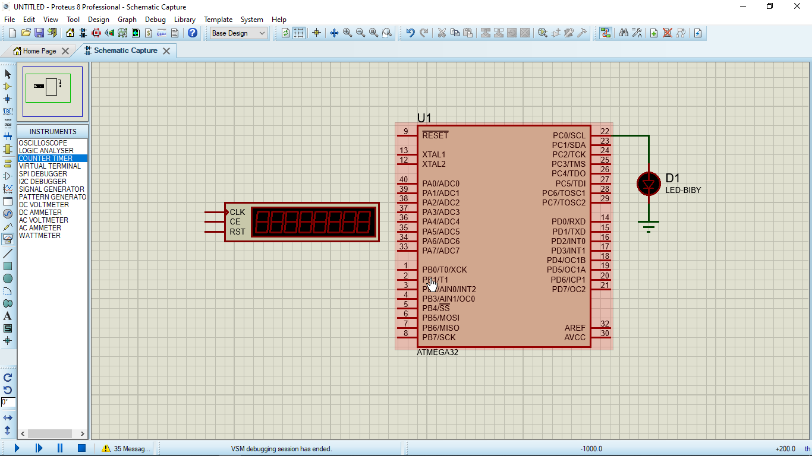
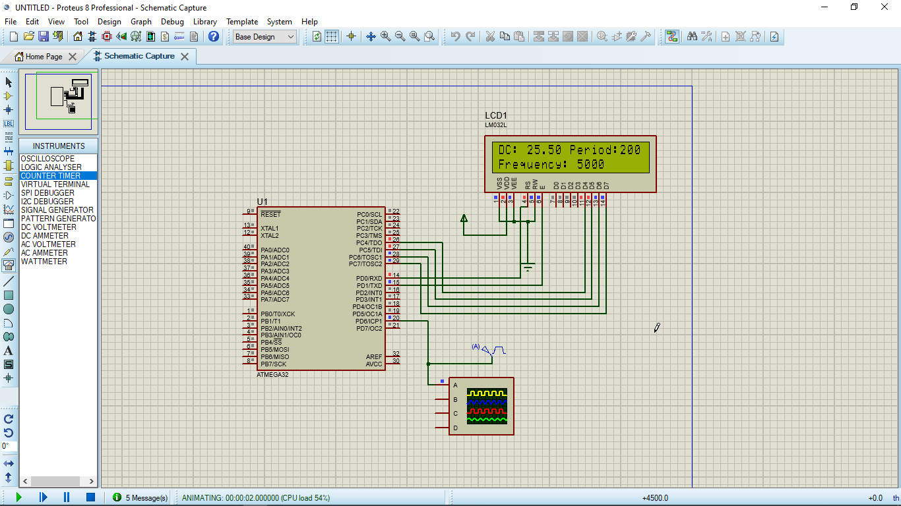
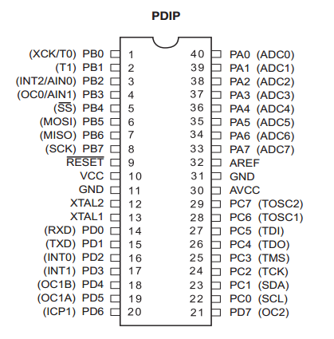
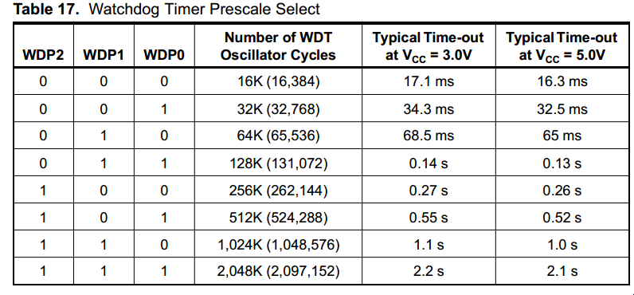

# Timers and PWM


* The Driver is written in Arduino functions Format to allow users understand avr Driver for Atmega 32


## Examples

### controlling pwm pins duty cycle using potentiometer

* This example shows how to interface Atmega32 timer pins as pwm and use a potentiometer to control their duty cycle    



```

#define F_CPU 1000000UL
#include "Gpio.h"
#include "ADC.h"
#include "timers.h"
#include <util/delay.h>

int main(void)
{

ADC_Init();
setUpPWM(B3);
setUpPWM(D4);
setUpPWM(D5);   
setUpPWM(D7);
int reading,pwmval;
    
    while (1) 
    {
		reading= analogRead(A0);
		pwmval=reading*((1.0*255)/1023);
		pwmWrite(B3,pwmval);
		pwmWrite(D4,pwmval);
		pwmWrite(D5,pwmval);
		pwmWrite(D7,pwmval);
        _delay_ms(50);		
    }
}

```

### WatchDog timer example

* This example demonstrates how to use WatchDog timer to reset the microcontroller every 2.1 sec inorder to Blink an LED.




```

#define F_CPU 1000000UL
#include "Gpio.h"
#include "timers.h"
#include <util/delay.h>

int main(void)
{	
    pinMode(C0,OUTPUT);
	WDT_ON(7);		/* Enable the watchdog timer */
	digitalWrite(C0,HIGH);	
	_delay_ms(1000);	/* Wait for 1 second */
	digitalWrite(C0,LOW);	
	
    while(1);
}

```

### Blink using timer interrupt example

* This example demonstrates how to use timer interrupt on timer 2(CTC mode) in the microcontroller every 5 sec inorder to Blink an LED.


```

#define F_CPU 1000000UL
#include "Gpio.h"
#include "ADC.h"
#include "timers.h"
#include <util/delay.h>
void Blink(){
	
	digitalWrite(C0,!digitalRead(C0));
	
}

int main(void)
{

pinMode(C0,OUTPUT);
 setUpPeriodicTimer(5000,PERIODIC,Blink);   
    while (1) 
    {
	
    }
}


```

## Blink using millis example

* This example demonstrates how to use timer0 (Timer Overflow Normal Mode) in to make millis in  the microcontroller inorder to Blink an LED every  1 sec.


```


#define F_CPU 1000000UL
#include "Gpio.h"
#include "ADC.h"
#include "timers.h"
#include <util/delay.h>
	

int main(void)
{

 pinMode(C0,OUTPUT);
 setUpPWM(D4);
 Timer(); 
 long long start_time = 0;
  long long end_time;
  while (1) 
    {
		end_time=millis();
		if((end_time - start_time) == 1000)
		{
		digitalWrite(C0,!digitalRead(C0));
		start_time=end_time;
		}
		pwmWrite(D4,200);
		
	}

}

```

## measure duty cycle, frequency , and period of a signal example

* This example demonstrates how to use Input capture mode of timer1 in the microcontroller in order  to measure  measure duty cycle, frequency , and period of a signal connected to ICP pin;




```


#define F_CPU 1000000UL
#include "Gpio.h"
#include "lcd.h"
#include "ADC.h"
#include "timers.h"
#include <util/delay.h>


int main(void)
{

	
	LCD_SetUpReg(D0,D1,REGC_UPPER);
	LCD_Begin(20,2);
	float dutycycle=0;
	int freq=0,per=0;
	while (1)
	{
		LCD_String_xy("DC: ",0,0);
		dutycycle = measureDutyCycle();
		LCD_Print(&dutycycle,FLOAT);
		LCD_String(" Period:");
		per=measurePeriod();
		LCD_Print(&per,INT);
		LCD_String_xy("Frequency: ",1,0);
		freq = measureFrequency();
		LCD_Print(&freq,INT);
		_delay_ms(50);
		
		}
	
}  

```

* In Atmega 32, We have 3 timers--> timer0, timer1 ,timer2. 
* In PWM mode , each timer is associated with a pwm pin. B3->timer0, D4->timer1B, D4->timer1A, D7->timer2.




* you have to avoid using pwm pins of the timer if the timer is used in another mode of operation.

* you can use counter timer in proteus to check pwm pins and the functionality of timers in different modes.

* when using watch dog timer, you have to select the required prescaler (from 0 to 7) according to the datasheet to have accurate timing.



